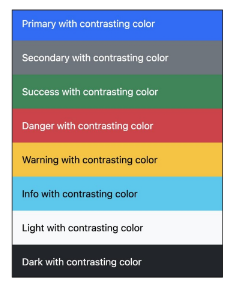

# Web Bootstrap

## Bootstrap

- Bootstrap : CSS 프론트엔드 프레임워크(Toolkit)
- CDN (content delivery network)
    - 서버와 사용자 사이의 물리적인 거리를 줄여 콘텐츠 로딩에 소요되는 시간을 최소화
    
    → 웹 페이지 로드 속도를 높임
    
    - 지리적으로 사용자와 가까운 CDN 서버에 콘텐츠를 저장해서 사용자에게 전달

### 1. Bootstrap 사용 가이드

- 기본 사용법
    - 특정한 규칙에 따라 클래스 이름으로 스타일 및 레이아웃 지정
    - `mt-5`  = margin - top 5
    - {property} {sides} - {size}
    - `
Hello, world! 
`
    

### 2. Reset CSS

- 모든 HTML 요소 스타일을 일관된 기준으로 재설정하는 간결하고 압축된 규칙 시트
- Bootstrap 을 HTML 에 반영하면 body, h1 등 기본 스타일이 재설정(초기화) 됨
- 사용 배경
    - 모든 브라우저는 각자 기본 ‘user agent stylesheet’ 가 있음
    - 근데 이 설정이 브라우저마다 다름
    - 모든 브라우저에서 동일하게 보이게 하려면 일관된 초기화 필요
- Normalize CSS - (Bootstrap 선택 방법)
    - Reset CSS 방법 중 대표적인 방법
    - 웹 표준 기준으로 브라우저 중 하나가 불일치 한다면 차이가 있는 브라우저를 수정하는 방법
- Bootstrap은 `bootstrap-reboot.css` 파일명으로 normalize.css 를 자체적으로 커스텀해서 사용

## Bootstrap 활용

### 1. Typography

- bootstrap 공식 문서 중 typography 파트 참고
    
    [https://getbootstrap.com/docs/5.3/content/typography/](https://getbootstrap.com/docs/5.3/content/typography/)
    

### 2. Colors

- Bootstrap 이 지정하고 제공하는 색상 시스템
- 일관성 있는 의미론적 관점의 색상을 적용할 수 있게 해 줌

### 3. Component

- Bootstrap 에서 제공하는 UI 관련 요소
    - 버튼, 네비게이션 바, 카드, 폼, 드랍다운
- component의 동작은 JavaScript를 활용해서 만들어집니다
- 만약 동작이 잘 되지 않을 경우,
    1. Bootstrap의 `<script>` 요소가 잘 추가되었는지 확인
    2. `data-*` 로 시작하는 속성들과 id 값이 잘 정의되어 있는지 확인
    
- 모달 주의사항
    - 모달과 모달 버튼 코드가 항상 같이 다닐 필요 없음 → 주로 모달 하단에 다 모아둠
    - 모달이 다른 코드와 중첩될 경우 z축 겹쳐져서 못 누를수도 있음

## Semantic Web

- 웹 데이터를 의미론적으로 구조화된 형태로 표현하는 방식
    
    → 요소의 시각적 측면이 아닌 요소의 목적과 역할에 집중하는 방식
    

### 1. Semantic in HTML

- 외형 보다는 요소 자체의 의미에 집중하는 것
    - `h1` : 단순히 글자를 크고 굵게 하는 게 아니라 “페이지 내 최상위 제목” 이라는 의미
- HTML Semantic Element 예시
    - header : 소개 및 탐색에 도움을 주는 콘텐츠
    - nav : 현재 페이지 내, 또는 다른 페이지로의 링크를 보여주는 구획
    - main : 문서의 주요 콘텐츠
    - article : 독립적으로 구분해 배포하거나 될 수 있는 구성의 콘텐츠 구획
    - section : 문서의 독립적인 구획
    - aside : 문서의 주요 내용과 간접적으로만 연관된 부분
    - footer : 가장 가까운 조상 구획의 작성자, 저작권 정보, 관련 문서

### 2. Semantic in CSS

- CSS를 효율적이고 유지 보수가 용이하게 작성하기 위한 일련의 가이드라인
- OOCSS  (Object Oriented CSS) : 객체 지향적 접근법을 적용하여 CSS를 구성하는 방법론
    - 구조와 스킨 분리
    - 컨테이너와 콘텐츠 분리

## 활동정리

| 개념 | 설명 | 예시 |
| --- | --- | --- |
| Bootstrap | 미리 만들어진 CSS Framework(Toolkit) |  |
| CDN | 지리적 제약 없이 빠르고 안전하게 콘텐츠를 전송할 수 있는 기술 | Bootstrap 은 CDN으로 설치 가능 |
| Reset CSS | HTML 요소의 스타일을 일관된 기준으로 재설정하는 규칙 시트 | bootstrap-reboot.css |
| Semantic HTML | 모양과 기능 이외의 의미를 갖는 요소 | <header>, <article>, <nav> |
| OOCSS | 객체지향적 접근법을 활용한 CSS 방법론 | 구조를 나타내는 .button과 스킨을 나타내는 .button-blue |