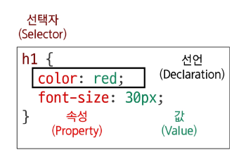

# HTML & CSS

## 웹

- Web site : 여러 개의 web page 가 모인 것, 사용자들에게 정보나 서비스를 제공하는 공간
- Web page : HTML, CSS 등의 웹 기술을 이용하여 만들어진, Web site를 구성하는 하나의 요소
    - HTML - 구조
    - CSS - 스타일링
    - Javascript - 행위

## 웹 구조화

### 1. HTML

- HTML (HyperText Markup Language) : 웹 페이지의 의미와 구조를 정의하는 언어
- HyperText : 웹 페이지를 다른 페이지로 연결하는 링크
    - 비선형성 / 상호연결성 / 사용자 주도적 탐색
- Markup Language : 태그 등을 이용하여 문서나 데이터의 구조를 명시하는 언어
    - 인간이 읽고 쓰기 쉬운 형태, 데이터의 구조와 의미를 정의하는 데 집중

### 2. Structure of HTML

- HTML 기본 구조
    
    ```html
    <!DOCTYPE html>
    <html lang="en">
    <head>
    	<meta charset="UTF-8">
    	<title>My page</title>
    </head>
    <body>
    	<p>This is my page</p>
    	<a href="https://www.google.co.kr/">Google</a>
    	
    </body>
    </html>
    ```
    
    - <html></html> : 전체 페이지의 콘텐츠를 포함
    - <title></title> : 브라우저 탭 및 즐겨찾기 시 표시되는 제목
    - <head></head> : HTML 문서에 관련된 설명, 설정 등 메타데이터 작성, 사용자에게 보이지 않음
    - <body></body> : HTML 문서의 내용을 나타냄, 한 문서에 하나의 body
    - <a></a> : 다른 페이지로 이동시키는 하이퍼링크 태그
    - </img> : src에 지정된 그림을 보여주는 태그
- HTML 요소(Element)
    - 하나의 요소는 여는 태그와 닫는 태그, 그 사이 내용으로 구성 (닫는 태그는 없는 것도 있음)
- HTML 속성(Attributes)
    - 사용자가 원하는 기준에 맞도록 요소를 설정하거나 요소의 동작을 조절하기 위한 값
    - CSS에서 스타일 적용을 위해 해당 요소를 선택하기 위한 값으로 활용
    - 작성 규칙
        - 속성은 요소 이름과 속성 사이에 공백이 있어야 함
        - 하나 이상의 속성들이 있는 경우엔 속성 사이에 공백으로 구분
        - 속성 값은 열고 닫는 따옴표로 감싸야 함
        
        `<p class="editor-note">My cat is very grumpy</p>`
        

### 3. Text Structure

- Heading & Paragraphs
    - h1~6, p
- Lists
    - ol, ul, li
- Emphasis & Importance
    - em, strong

## 웹 스타일

### 1. CSS : Cascading Style Sheet

- CSS 적용 방법
    - 인라인 스타일 : html 요소 안에
    - 내부 스타일 시트 : head 태그 안에 style 태그 작성
    - 외부 스타일 시트 : 별도 css 파일 생성 후 html link 태그를 사용해 불러오기
    - 우선순위 - 인라인 > 내부 > 외부
    
    ```html
    <!DOCTYPE html>
    <html lang="en">
    
    <head>
      <meta charset="UTF-8">
      <meta name="viewport" content="width=device-width, initial-scale=1.0">
      <title>Document</title>
      <link rel="stylesheet" href="style.css">     # 외부
      <style>
        h2{                  # 내부
          color: red;
          background-color: black;
        }
      </style>
    </head>
    
    <body>
      <h1 style="color: blue; background-color: yellow;">Inline Style</h1>  # 인라인
      <h2>Internal Style</h2>
      <h3>External Style</h3>
    </body>
    
    </html>
    ```
    

### 2. CSS 구문

- 기본 구조와 문법
    - 선택자(Selector) : 누구를 꾸밀건지 선택
    - 선언(Declaration) : 어떻게 할 건지 속성 : 값 쌍으로 이루어지고 ; 으로 끝남
    - 속성(Property) : 바꾸고 싶은 스타일의 종류
    - 값(Value) : 속성에 적용할 구체적인 설정
    
    
    

### 3. CSS 선택자

- CSS Selectors 종류
    - 기본선택자
        - 전체(*) 선택자 : html 모든 요소를 선택
        - 요소(tag) 선택자 : 지정한 모든 태그를 선택
        - 클래스(class) 선택자 : ‘ . ’ (dot)
            - 주어진 클래스 속성을 가진 모든 요소를 선택
        - 아이디(id) 선택자 : ‘ # ‘
            - 문서에는 주어진 아이디를 가진 요소가 하나만 있어야 함
        - 속성(attr) 선택자 등 : ‘ [ ] ‘
    
    
    
    - 결합자 (Combinators)
        - 자손 결합자 (” “ (space)) : 첫 번째 요소의 자손들 선택
        - 자식 결합자 (”>”) : 첫 번째 요소의 직계 자식만 선택
        
        
        

### 4. CSS 선언

- 값의 단위
    
    
    | 구분 | 단위 종류 | 특징 |
    | --- | --- | --- |
    | 절대 단위 | px, pt, cm 등 | 다른 요소의 영향을 받지 않는 고정된 크기 |
    | 상대 단위 | %, em, rem, vw, vh 등 | 다른 요소(부모, 화면 표시 영역 등) 의 크기에 따라 상대적으로 결정 |
    - px - 픽셀 기준 단위, 모니터 해상도에 따라 결정, 요소 크기를 명확히 고정, 접근성에 불리
    - em - 부모 요소의 크기를 기준으로 결정, 유연하게 조절할 수 있으나 요소가 중첩되면 문제 발생
    - rem - 부모 요소가 아닌 <html> 의 font-size를 기준으로 크기 결정 (기본 크기 16px)
    
    | 단위 | 기준 | 장점 | 단점/주의사항 | 추천 사용처 |
    | --- | --- | --- | --- | --- |
    | px | 화면의 픽셀 | 직관적, 고정된 크기 | 접근성/반응형에 불리 | border-width 등 절대적 크기가 필요할 때 |
    | em | 부모 요소의 font-size | 부모에 따라 유연하게 변경 | 중첩 시 계산 복잡 | 특정 컴포넌트 내부에서만 상대적 크기 조절이 필요할 때 |
    | rem | <html>의 font-size | 일관성, 유지보수성, 접근성 | 루트 폰트 크기에 의존적 | 웹사이트 전반의 font-size, margin, padding 등 |
    | % | 부모 요소의 크기 | 컨테이너에 맞춰 유동적으로 | font-size에 사용 시 em과 유사하게 동작 | width, height 등 레이아웃 구성 시 |

### 5. 명시도 : 결과적으로 요소에 적용할 CSS 선언을 결정하기 위한 알고리즘

```html
h1{
	color: red;
}
h1{
	color: purple;
}	
```

- 아래에 적은 puple이 적용

```html
.make-red{
	color:red;
}
h1{
	color:puple;
}
```

- 명시도가 더 높은 클래스 선택자를 따라서 red 적용
- 명시도 높은 순
    1. Importance `!important`  → 비권장
    2. Inline 스타일  → 비권장
    3. **선택자 (id 선택자 > class 선택자 > 요소 선택자)**
    4. 소스 코드 선언 순서 (위에서 아래로)

### 6. 상속

- 상속되는 속성과 상속되지 않는 속성이 있다
    
    → 상속 여부는  MDN의 각 속성별 문서 하단에서 확인
    

```html
<!DOCTYPE html>
<html lang="en">

<head>
  <meta charset="UTF-8">
  <meta name="viewport" content="width=device-width, initial-scale=1.0">
  <title>Document</title>
  <style>
    .parent {
      /* 상속 O */
      color: red;

      /* 상속 X */
      border: 1px solid black;
    }
  </style>
</head>

<body>
  <ul class="parent">
    <li class="child">Hello</li>
    <li class="child">Bye</li>
  </ul>
</body>

</html>
```

## CSS Box Model : 웹 페이지의 모든 HTML 요소를 감싸는 사각형 상자 모델

### 1. 박스 구성 요소

- 내용(content) : 실제 내용이 위치하는 영역
- 안쪽 여백(padding)
- 테두리(border)
- 외부 간격(margin) : 이 박스와 다른 요소와의 외부 간격 (테두리 바깥 쪽)


### 2. shorthand 속성(단축 속성)


### 3. box-sizing 속성(박스의 크기 계산법)

- 표준 상자 모델에서 width와 height 속성 값을 설정하면, 이 값은 content box 의 크기를 조정
- box-sizing 초기 설정 필요
    
    
    

## 참고

### 1. 명시도 관련

- 그림으로 보는 명시도  https://specifishity.com/
- 명시도 계산기  https://specificity.keegan.st/

### 2. HTML 스타일 가이드

- html은 대소문자를 구분하지 않지만, 소문자 사용 권장
- 속성 값에는 큰 따옴표를 사용하는 것이 일반적
- 일관된 들여쓰기 사용
- 각 요소는 한 줄에 하나씩 작성
- 중첩된 요소는 한 단계 더 들여쓰기
- html 은 연속된 공백을 하나로 처리
- Enter 키로 줄 바꿈을 해도 브라우저에서 인식하지 않음 → 줄바꿈 태그 사용해야 함
- 문법 오류가 있어도 별도의 에러 메시지를 출력하지 않음

### 3. CSS 스타일 가이드

- 중괄호 앞에 공백 넣기
- 속성 뒤에는 콜론( : ) 과 공백 넣기
- 마지막 속성 뒤에는 세미콜론( ; ) 넣기
- Class 선택자를 우선적으로 사용

### 4. MDN : Mozilla Developer Network 에서 제공하는 웹 개발자와 디자이너를 위한 온라인 문서

