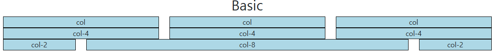
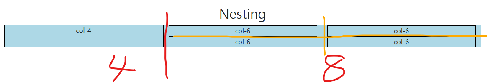
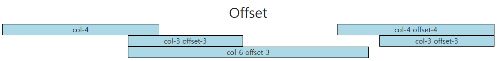
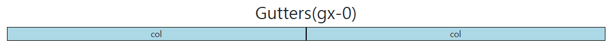
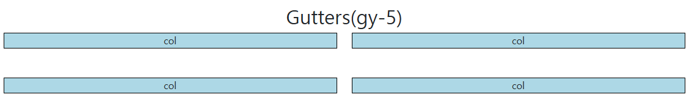
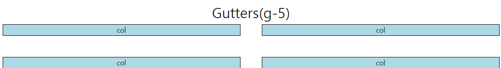

# Web Responsive Web

## Bootstrap Grid system

- 웹 페이지의 레이아웃을 조정하는 데 사용되는 12개의 컬럼으로 구성된 시스템
- 반응형 디자인을 지원해 웹 페이지를 모바일, 태블릿, 데스크탑 등 다양한 기기에서 적절하게 표시할 수 있도록 도와

### 1. Grid system 구조

`container > row > col`

- Container : Column 들을 담고 있는 공간
- Column : 실제 컨텐츠를 포함하는 부분
- Gutter : 컬럼과 컬럼 사이의 여백 영역(상하좌우)
    - x축은 padding, y축은 margin으로 여백을 생성
    - 실제 컬럼 간 좌우 간격(x축)은 변하지 않으며, padding으로 인해 컬럼 안에 contents의 너비가 변함
- 1개의 row 안에 12 개의 column 영역이 구성
    - 각 요소는 12개 중 몇 개를 차지할 것인지 지정됨

```html
<div class="container">
  <div class="row">
    <div class="col-4"></div>
    <div class="col-4"></div>
    <div class="col-4"></div>
  </div>
</div>
```

### 2. Grid system 실습

- 기본
    
    
    
    ```html
    <h2 class="text-center">Basic</h2>
      <div class="container">
        <div class="row">
          <div class="col">
            <div class="box">col</div>
          </div>
          <div class="col">
            <div class="box">col</div>
          </div>
          <div class="col">
            <div class="box">col</div>
          </div>
        </div>
        
        <div class="row">
          <div class="col-4">
            <div class="box">col-4</div>
          </div>
          <div class="col-4">
            <div class="box">col-4</div>
          </div>
          <div class="col-4">
            <div class="box">col-4</div>
          </div>
        </div>
        
        <div class="row">
          <div class="col-2">
            <div class="box">col-2</div>
          </div>
          <div class="col-8">
            <div class="box">col-8</div>
          </div>
          <div class="col-2">
            <div class="box">col-2</div>
          </div>
        </div>
      </div>
    ```
    
- 중첩
    1. 4 : 8 로 크게 먼저 나누고
    2. 8 중 row 를 한 번 더 줘서 12로 만들고, 12를 6 / 6 / 6 / 6 으로 나눠서 ‘12가 넘으면 넘쳐서 새로운 행으로 내려간다’는 특성을 이용해 2행 2열로 배치
    
    
    
    ```html
    <h2 class="text-center">Nesting</h2>
      <div class="container">
        <div class="row">
          <div class="col-4 box">
            <div>col-4</div>
          </div>
          <div class="col-8 box">
            <div class="row">
              <div class="col-6">
                <div class="box">col-6</div>
              </div>
              <div class="col-6">
                <div class="box">col-6</div>
              </div>
              <div class="col-6">
                <div class="box">col-6</div>
              </div>
              <div class="col-6">
                <div class="box">col-6</div>
              </div>
            </div>
          </div>
        </div>
      </div>
    ```
    
- 상쇄(offset)
    - 상쇄하고 다음으로 나타날 콘텐츠에 `offset-{숫자}` 속성 적용
    
    
    
    ```html
    <h2 class="text-center">Offset</h2>
    <div class="container">
        <div class="row">
          <div class="col-4">
            <div class="box">col-4</div>
          </div>
          <div class="col-4 offset-4">
            <div class="box">col-4 offset-4</div>
          </div>
        </div>
        <div class="row">
          <div class="col-3 offset-3">
            <div class="box">col-3 offset-3</div>
          </div>
          <div class="col-3 offset-3">
            <div class="box">col-3 offset-3</div>
          </div>
        </div>
        <div class="row">
          <div class="col-6 offset-3">
            <div class="box">col-6 offset-3</div>
          </div>
        </div>
      </div>
    </div>
    ```
    
- gutter (여백) - 여백은 `row` 에 적용
    - 여백 제거(gx-0)
    
    
    
    ```html
    <h2 class="text-center">Gutters(gx-0)</h2>
      <div class="container">
        <div class="row gx-0">
          <div class="col-6">
            <div class="box">col</div>
          </div>
          <div class="col-6">
            <div class="box">col</div>
          </div>
        </div>
      </div>
    ```
    
    - row 사이 여백 증가
    
    
    
    ```html
    <h2 class="text-center">Gutters(gy-5)</h2>
      <div class="container">
        <div class="row gy-5">
          <div class="col-6">
            <div class="box">col</div>
          </div>
          <div class="col-6">
            <div class="box">col</div>
          </div>
          <div class="col-6">
            <div class="box">col</div>
          </div>
          <div class="col-6">
            <div class="box">col</div>
          </div>
        </div>
      </div>
    ```
    
    - row, col 여백 모두 적용
    
    
    
    ```html
    <h2 class="text-center">Gutters(g-5)</h2>
      <div class="container">
        <div class="row g-5">
          <div class="col-6">
            <div class="box">col</div>
          </div>
          <div class="col-6">
            <div class="box">col</div>
          </div>
          <div class="col-6">
            <div class="box">col</div>
          </div>
          <div class="col-6">
            <div class="box">col</div>
          </div>
        </div>
      </div>
    ```
    

## Grid system for responsive web

- Bootstrap grid system에서는 12개의 column과 6개의 breakpoints를 사용하여 반응형 웹 구현

### 1. Grid system Breakpoints

- xs ~ xxl 까지 각 breakpoints 마다 설정된 최대 너비 값 “이상으로” 화면이 커지면 grid system 동작이 변경됨
- `col-{사이즈}-{col개수}` , `col-md-6` : md 사이즈 이상에서 col 6개 차지

### 2. Breakpoints 실습

- 사이즈별로 col 영역이 달라지도록 만들어보기

```html
<h2 class="text-center">Breakpoints</h2>
  <div class="container">
    <div class="row">
      <div class="col-12 col-sm-6 col-md-2 col-lg-3 col-xl-4">
        <div class="box">col</div>
      </div>
      <div class="col-12 col-sm-6 col-md-8 col-lg-3 col-xl-4">
        <div class="box">col</div>
      </div>
      <div class="col-12 col-sm-6 col-md-2 col-lg-3 col-xl-4">
        <div class="box">col</div>
      </div>
      <div class="col-12 col-sm-6 col-md-12 col-lg-3 col-xl-12">
        <div class="box">col</div>
      </div>
    </div>
  </div>
```

- + offset 추가
    - offset을 줄 때는 더 큰 사이즈를 고려해서 의도에 따라 초기화를 해줘야 할 수 있음
        
        (밑의 코드에서는 `offset-md-0` 부분)
        

```html
<h2 class="text-center">Breakpoints + offset</h2>
  <div class="container">
    <div class="row g-4">
      <div class="col-xs-12 col-sm-4 col-md-6">
        <div class="box">col</div>
      </div>
      <div class="col-xs-12 col-sm-4 col-md-6">
        <div class="box">col</div>
      </div>
      <div class="col-xs-12 col-sm-4 col-md-6">
        <div class="box">col</div>
      </div>
      <div class="col-xs-12 col-sm-4 col-md-6 offset-sm-4 offset-md-0">
        <div class="box">col</div>
      </div>
    </div>
  </div>
```

### 3. CSS Layout 종합 정리

- position
    - absolute, fixed
- flexbox - 정렬, 공간 (세로축, 가로축)
    - justify, align, column, row
- grid system - 전체 배치
    - col-3, col-md-4

## UX & UI

### 1. UX (User Experience)

- 사용자의 경험과 만족도를 개선하고 최적화하기 위한 디자인과 개발 분야

### 2. UI (User Interface)

- 서비스와 사용자 간의 상호작용을 가능하게 하는 디자인 요소들을 개발하고 구현하는 분야

## 참고

### 1. Grid cards

- card 요소에 대해서는 row 에서 행 별 card 개수를 한 번에 설정할 수 있음

```html
<div class="container">
    <div class="row row-col-1 row-col-sm-3 row-cols-md-2 g-4">
      <div class="col">
        <div class="card">
          <div class="card-body">
            <h5 class="card-title">Card title</h5>
            <p class="card-text">This is a longer card with supporting text below as a natural lead-in to additional
              content. This content is a little bit longer.</p>
          </div>
        </div>
      </div>
    </div>
</div>
```

## 활동정리

- 활동정리

| 개념 | 설명 |
| --- | --- |
| Responsive Web | 화면 크기에 상관없이 일관된 사용자 경험을 제공하는 디자인 기술 |
| Bootstrap Grid system | 웹 페이지 레이아웃을 12개의 컬럼으로 조정하는 시스템 |
| Breakpoints | Grid system의 배치를 조정하기 위한 화면 크기 분기점 |
| UX | 사용자가 느끼는 경험과 만족도를 개선하기 위한 디자인과 개발 분야 |
| UI | 사용자의 상호작용을 가능하게 하는 요소를 개발하고 구현하는 분야 |